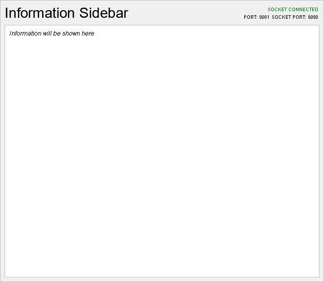
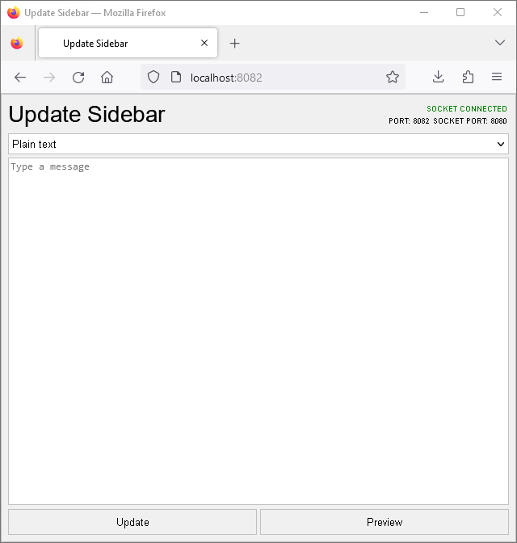

# Sidebar

## 1. Introduction
This is a Node.js script that will run a WebSocket server running on the port 8080, serve the sidebar page on the port 8081, and serve the UI to update the sidebar on the port 8082. Those are the default ports and can be changed by editing the ``sidebar.node.js`` script.



The source files for the sidebar and the sidebar changer UI, and [Marked](https://github.com/markedjs/marked) is included in the ``pages`` folder. 

## 2. Installation
Just ``git clone`` this repository and run the ``sidebar.node.js`` script inside it. You can install or upgrade the modules used by this script by running the command below while on the script's directory:
```
npm install readline http ws fs path
```
To change the preset message, edit the ``msgdata.json`` file using one of the formats above.

## 3. Usage
1. While the script is running, you can change the message in real-time by typing the message to the terminal in one of the formats below. Press Enter to submit the message.
  * **Plain text**
  ```
  {"type":"plain", "message":"Hello World"}
  ```
  * **Markdown**
  ```
  {"type":"markdown", "message":"Hello World"}
  ```
> If you want to include the double-quote and backslash marks in your message, use ``\"`` and ``\\``, respectively.

2. Or, you can access the port 8082 (by default) to access the web-based UI to change the message. The UI is simple and intuitive. You choose the message type, type in the message, and hit the Update button.



> This is the recommended way to edit the sidebar. If you don't understand how does JSON work, I recommend you to use the web-based UI instead.

## 4. Licensing
``sidebar.node.js``, its dependencies, and Marked is licensed under [the MIT license](LICENSE).
