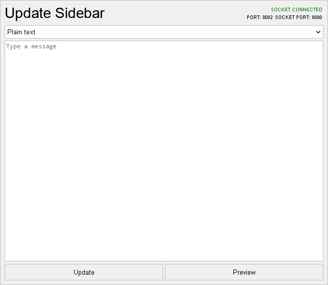

# Sidebar

[](https://github.com/intel386dx/sidebar/commits/main) [](https://github.com/intel386dx/sidebar/archive/main.zip)


## 1. Introduction
This is a Node.js script that will run a WebSocket server running on the port 8080, serve the sidebar page on the port 8081, and serve the UI to update the sidebar on the port 8082. Those are the default ports and can be changed by editing the ``sidebar.node.js`` script.


The source files for the sidebar, the sidebar changer UI, and the minified versions of [Marked](https://github.com/markedjs/marked) and [DOMPurify](https://github.com/cure53/DOMPurify) is included in the ``pages`` folder. 

## 2. Installation
Installing it is quite easy.

### 2.1. Install Node.js
Go to [https://nodejs.org/en/download](https://nodejs.org/en/download) and download the right installer package for your operating system.

### 2.1.1. Microsoft Windows
In the _**Windows Installer (.msi)**_ section, select _**32-bit**_ or _**64-bit**_ to download the Windows Installer package. Run it, and follow the on-screen instructions.

### 2.1.2. macOS
In the _**macOS Installer (.pkg)**_ section, select _**64-bit / ARM64**_ to download the macOS installer package. Run it, and follow the on-screen instructions.

### 2.1.3. Linux
Install it from the [Snap Store](https://snapcraft.io/node).
```shell
sudo snap install node --classic
```

### 2.1.4. Android
Download and install the latest version of Termux from [F-Droid](https://f-droid.org/en/packages/com.termux/). Open the Termux app, wait for the base system packages to be installed, and install Node.js by running the command below.
```shell
pkg install node
```

## 2.2. Running the script 

Just ``git clone`` this repository and run the ``sidebar.node.js`` script inside it. You can install or upgrade the modules used by this script by running the command below while on the script's directory:
```
npm install readline http ws fs path
```
To change the preset message, edit the ``msgdata.json`` file using one of the formats above.

### 2.3. Minifying the script

You can use UglifyJS to minify the script by following these steps:

1. Install the UglifyJS command-line tool by running:
```
npm install uglify-js -g
```
2. Now minify the script by running:
```
uglifyjs sidebar.node.js > sidebar.node.min.js
```

## 3. Usage
1. While the script is running, you can change the message in real-time by typing the message to the prompt in one of the formats below. Press Enter to submit the message.
  - **Plain text**
  ```json
  {"type":"plain", "message":"Hello World"}
  ```
  - **Markdown**
  ```json
  {"type":"markdown", "message":"Hello World"}
  ```
> **Note:** If you want to include the double-quote and backslash marks in your message, use ``\"`` and ``\\``, respectively.
> For example:
> ```json
> {"type":"plain", "message":"Press the Windows logo key + R, type \"C:\\Windows\\System32\\cmd.exe\", and then select OK."}
> ```
> will output something like this:
>
> 

2. Or, you can access the port 8082 (by default) to access the web-based UI to change the message. The UI is simple and intuitive. You choose the message type, type in the message, and hit the Update button.



> **Note:** This is the recommended way to edit the sidebar. If you don't understand how does JSON work, I recommend you to use the web-based UI instead.

## 4. Licensing
See [LICENSE.md](LICENSE.md) for more information.
